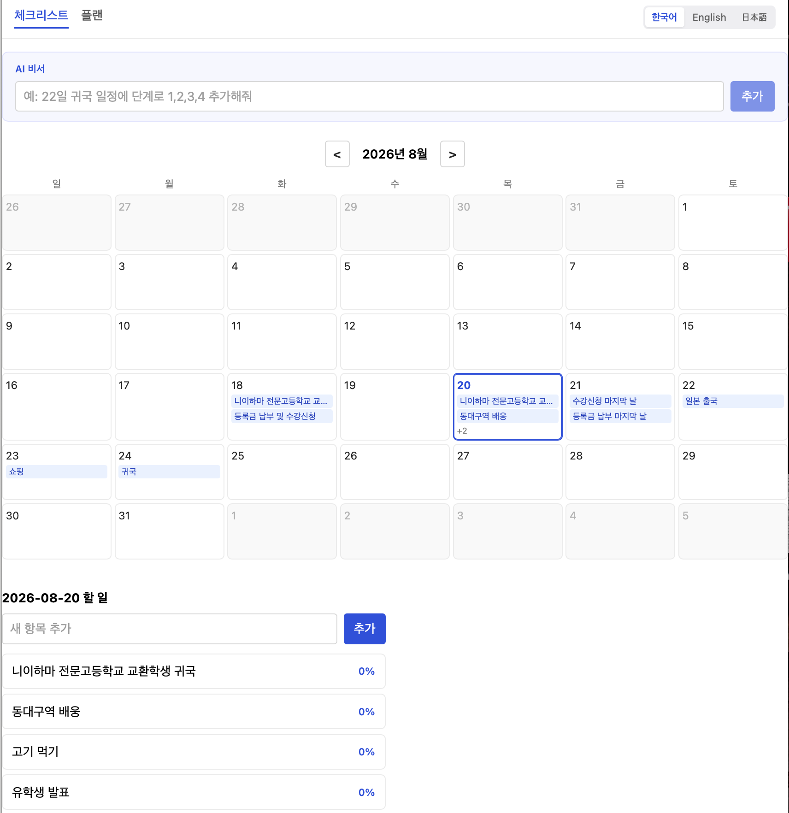
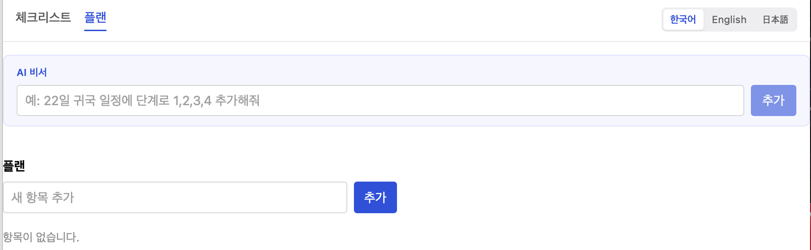
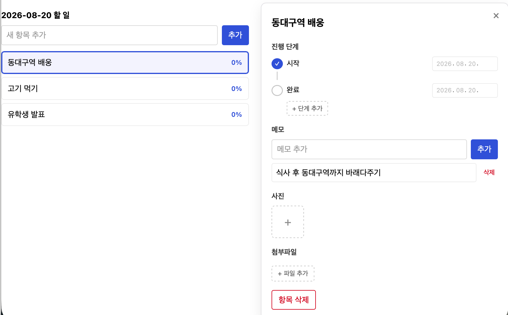
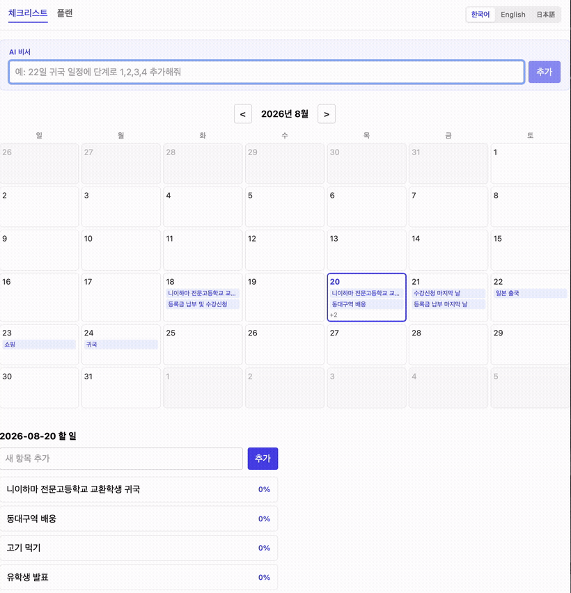
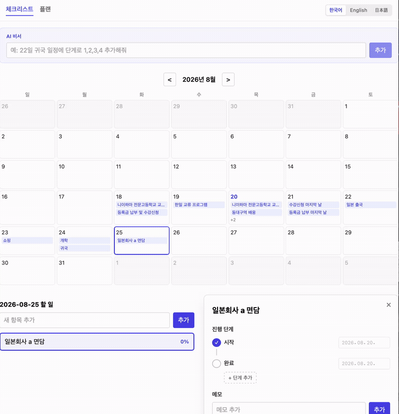
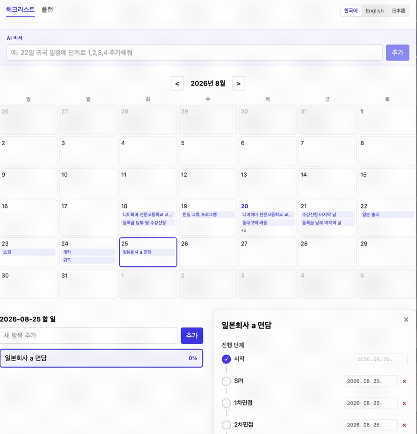
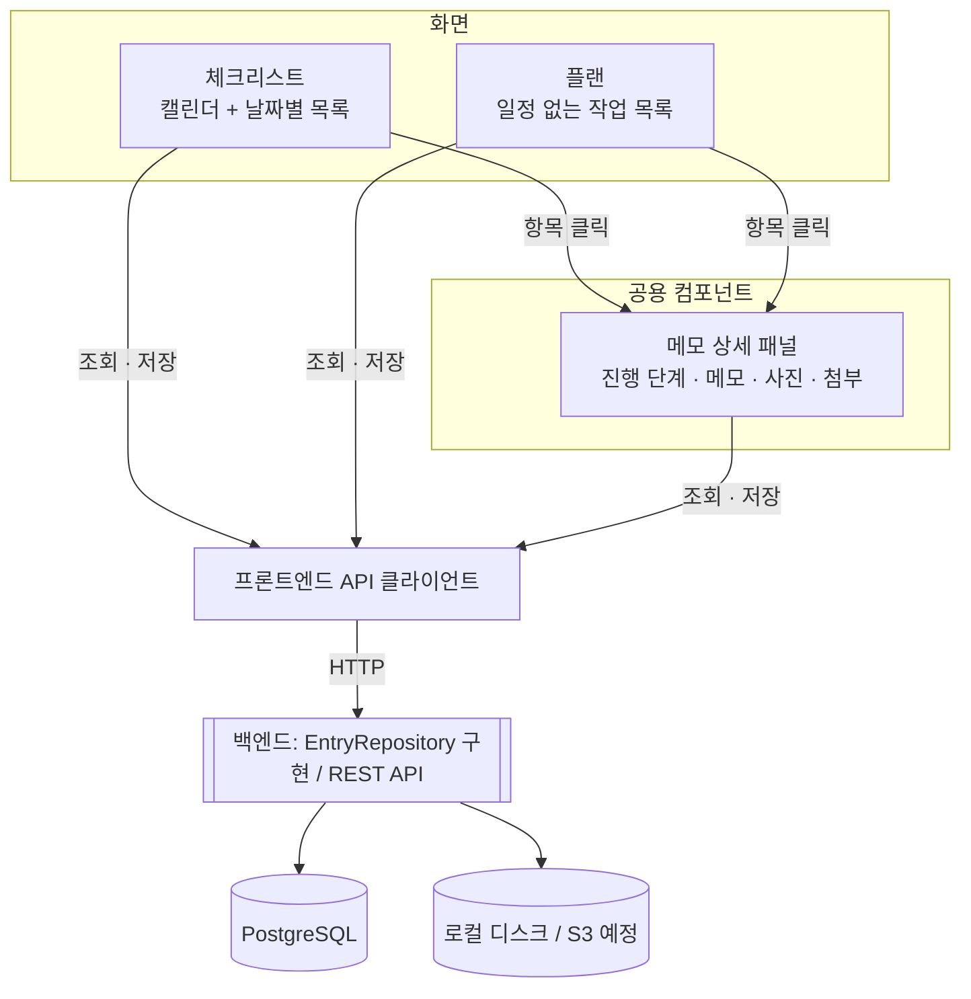
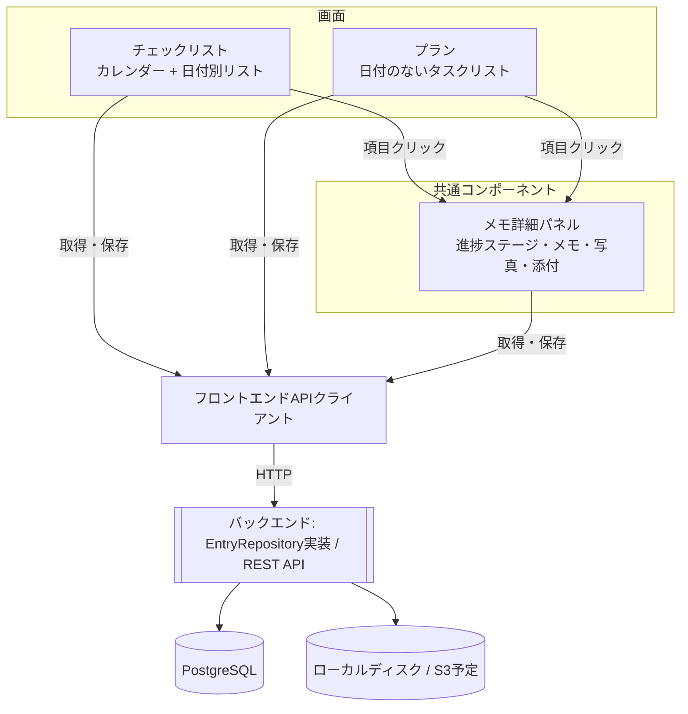

# Planly

캘린더 기반 체크리스트 + 날짜 없는 플랜을 함께 관리하는 개인용 할 일 관리 앱입니다. AI 비서로 자연어 일정 입력을 지원하고, 한국어/English/日本語 다국어 UI를 제공합니다.

カレンダー連動のチェックリストと、日付のない自由なプランをあわせて管理する個人用タスク管理アプリです。AIアシスタントによる自然言語での予定入力に対応し、韓国語/English/日本語の多言語UIを提供します。

---

### 소개

사용자가 할 일을 두 가지 방식으로 관리하는 앱입니다. 날짜가 정해진 일은 캘린더에 붙여서 **체크리스트**로 관리하고, 날짜와 상관없이 자유롭게 쌓아 두는 일은 **플랜**으로 관리합니다. 두 화면 모두 항목을 클릭하면 같은 형태의 상세 패널이 인라인 모달로 나타나며, 여기서 진행 단계, 메모, 사진, 첨부파일을 관리합니다.

협업 도구가 아니라 개인용 앱입니다. 할 일을 다른 사람에게 배정하거나 공유하는 기능은 없고, 데이터 구조와 화면은 1인 사용자 기준으로 설계되어 있습니다.

### 概要

やることを二つの方法で管理するアプリです。日付が決まっているタスクはカレンダーに紐づけて**チェックリスト**として管理し、日付に関係なく自由に積んでおくタスクは**プラン**として管理します。どちらの画面でも項目をクリックすると同じ形式の詳細パネルがインラインモーダルで表示され、進捗ステージ・メモ・写真・添付ファイルを管理できます。

チームで開発していますが、実際の使い方は個人用です。タスクを他人に割り当てたり共有したりする機能はなく、データ構造・画面は1人のユーザーを前提に設計されています。

### 스크린샷

| 체크리스트 (캘린더 + AI 비서) | 플랜 | 상세 패널 |
| --- | --- | --- |
|  |  |  |

### スクリーンショット

| チェックリスト (カレンダー + AIアシスタント) | プラン | 詳細パネル |
| --- | --- | --- |
|  |  |  |

### 데모 (AI 비서 · 실시간 번역) | デモ (AIアシスタント・リアルタイム翻訳)

**자연어로 일정 추가** — 상단 AI 비서 입력창에 "24일 개학 일정 추가해줘"처럼 자연어로 요청하면 해당 날짜에 항목이 자동 생성되고 캘린더가 그 날짜로 이동합니다.

自然言語で予定を追加 — 上部のAIアシスタント入力欄に「24日の開講予定を追加して」のように自然言語でリクエストすると、その日付に項目が自動生成され、カレンダーがその日付に移動します。



**자연어로 기존 일정 수정** — 이미 있는 항목을 가리키는 요청("25일 일본회사 면담에 단계 추가해줘" 등)을 보내면 새로 만들지 않고 기존 항목에 진행 단계·메모가 반영됩니다.
自然言語で既存の予定を修正 — すでにある項目を指すリクエスト(「25日の日本企業面談にステージを追加して」など)を送ると、新規作成ではなく既存の項目に進捗ステージ・メモが反映されます。



**콘텐츠 실시간 번역** — 화면 언어를 전환하면 사용자가 입력한 제목·진행 단계·메모까지 Claude API 기반 번역이 적용되어 즉시 다른 언어로 보입니다(원본 데이터는 그대로 보존).
コンテンツのリアルタイム翻訳 — 表示言語を切り替えると、ユーザーが入力したタイトル・進捗ステージ・メモまでClaude APIベースの翻訳が適用され、即座に別の言語で表示されます(元データはそのまま保持されます)。



### 주요 기능

- **캘린더 기반 체크리스트** — 월간 캘린더에서 날짜를 선택하면 그 날짜에 연결된 할 일 목록이 펼쳐집니다.
- **플랜** — 날짜와 무관하게 쌓아 두는 자유 작업 목록입니다.
- **진행 단계 타임라인** — 모든 항목은 기본으로 "시작"/"완료" 단계를 가지며, 그 사이에 원하는 만큼 중간 단계(서류 제출, 1차 면접 등)를 추가할 수 있습니다. 진행률(%)은 완료된 구간 수로 자동 계산됩니다.
- **메모 / 사진 / 첨부파일** — 항목별로 문장 메모, 이미지, 파일을 여러 개 첨부할 수 있습니다.
- **AI 비서** — 화면 상단 입력창에 자연어로 요청하면 Claude API가 현재 일정 컨텍스트를 참고해 항목·단계·메모를 생성/수정/삭제합니다. 이미 존재하는 항목은 수정하고, 새로운 일은 새 항목으로 만들며 중복 생성하지 않습니다.
- **다국어 (한국어 / English / 日本語)** — UI 텍스트는 `react-i18next`로 전환되고, 사용자가 직접 입력한 항목 제목·메모·단계 이름은 Claude API 기반 번역 API로 화면 언어에 맞게 자동 번역되어 표시됩니다(원본 데이터는 그대로 보존).

### 主な機能

- **カレンダー連動チェックリスト** — 月間カレンダーで日付を選ぶと、その日に紐づくタスク一覧が展開されます。
- **プラン** — 日付に関係なく積んでおく自由なタスクリストです。
- **進捗ステージのタイムライン** — すべての項目はデフォルトで「開始」/「完了」のステージを持ち、その間に必要な数だけ中間ステージ(書類提出、一次面接など)を追加できます。進捗率(%)は完了した区間数から自動計算されます。
- **メモ / 写真 / 添付ファイル** — 各項目に文章メモ、画像、ファイルを複数添付できます。
- **AIアシスタント** — 画面上部の入力欄に自然言語でリクエストすると、Claude APIが現在の予定コンテキストを参照して項目・ステージ・メモを作成/更新/削除します。既存の項目があれば更新し、新しい用件は新規項目として作成するため重複作成はされません。
- **多言語対応(韓国語 / English / 日本語)** — UIテキストは`react-i18next`で切り替わり、ユーザーが入力した項目タイトル・メモ・ステージ名はClaude APIベースの翻訳APIによって表示言語に合わせて自動翻訳されます(元データはそのまま保持されます)。

### 기술 스택

| 영역 | 스택 |
| --- | --- |
| Frontend | React, Vite, TypeScript, react-router-dom, react-i18next |
| Backend | Node.js, Express, TypeScript, Zod |
| Database | PostgreSQL (배포 환경은 AWS RDS) |
| 파일 저장 | 현재 백엔드 로컬 디스크(`multer`) — 추후 S3 이전 검토 |
| AI | Anthropic Claude API (일정 어시스턴트, 콘텐츠 번역) |

모노레포 구조로 `frontend/`, `backend/` 디렉터리가 분리되어 있습니다.

### 技術スタック

| 領域 | スタック |
| --- | --- |
| フロントエンド | React, Vite, TypeScript, react-router-dom, react-i18next |
| バックエンド | Node.js, Express, TypeScript, Zod |
| データベース | PostgreSQL(本番環境はAWS RDS) |
| ファイル保存 | 現状はバックエンドのローカルディスク(`multer`)— 今後S3への移行を検討 |
| AI | Anthropic Claude API(予定アシスタント、コンテンツ翻訳) |

モノレポ構成で `frontend/`、`backend/` ディレクトリが分かれています。

### 프로젝트 구조

```
three_arrows/
├── backend/               # Express REST API
│   └── src/
│       ├── ai/            # AI 비서 (Tool Runner 기반 자연어 처리)
│       ├── db/             # PostgreSQL 연결 및 schema.sql
│       ├── domain/        # Entry / ProgressStage 등 도메인 타입
│       ├── repository/    # Repository 패턴 구현체 (PgEntryRepository)
│       ├── routes/        # /api/entries, /api/ai, /api/translate
│       └── storage.ts     # 사진/첨부파일 로컬 저장
├── frontend/              # React + Vite 프론트엔드
│   └── src/
│       ├── api/           # 백엔드 API 클라이언트
│       ├── components/    # 캘린더, 상세 패널 등 UI 컴포넌트
│       ├── contexts/      # 콘텐츠 번역 컨텍스트 등
│       ├── i18n/          # 다국어 리소스 (ko/en/ja)
│       └── pages/         # 체크리스트 / 플랜 페이지
└── DEPLOY.md              # 프로덕션 배포 가이드
```

### プロジェクト構成

```
three_arrows/
├── backend/               # Express REST API
│   └── src/
│       ├── ai/            # AIアシスタント(Tool Runnerベースの自然言語処理)
│       ├── db/             # PostgreSQL接続とschema.sql
│       ├── domain/        # Entry / ProgressStage などのドメイン型
│       ├── repository/    # Repositoryパターンの実装(PgEntryRepository)
│       ├── routes/        # /api/entries, /api/ai, /api/translate
│       └── storage.ts     # 写真/添付ファイルのローカル保存
├── frontend/              # React + Vite フロントエンド
│   └── src/
│       ├── api/           # バックエンドAPIクライアント
│       ├── components/    # カレンダー、詳細パネルなどのUIコンポーネント
│       ├── contexts/      # コンテンツ翻訳コンテキストなど
│       ├── i18n/          # 多言語リソース(ko/en/ja)
│       └── pages/         # チェックリスト / プランページ
└── DEPLOY.md              # 本番デプロイガイド
```

### 아키텍처

프론트엔드는 `EntryRepository` 인터페이스(API 클라이언트)로만 데이터에 접근하고, 백엔드가 REST 엔드포인트 + PostgreSQL로 그 인터페이스를 구현합니다. 체크리스트와 플랜은 화면만 다를 뿐 같은 `Entry` 데이터 구조를 공유합니다.

**핵심 데이터 모델**

| 모델 | 설명 |
| --- | --- |
| `Entry` | 체크리스트/플랜 공용 항목. `scheduledDate`가 있으면 체크리스트에, `null`이면 플랜에 표시 |
| `ProgressStage` | 진행 단계 타임라인. 기본 "시작"/"완료" + 사용자 정의 중간 단계, `done`으로 완료 여부 표시 (진행률은 이 값들로부터 계산되는 파생값) |
| `MemoLine` | 체크박스 없는 순수 텍스트 메모 |
| `Photo` / `Attachment` | 항목별 이미지/파일 첨부 (현재 백엔드 로컬 디스크에 저장) |



### アーキテクチャ

フロントエンドは `EntryRepository` インターフェース(APIクライアント)を通じてのみデータにアクセスし、バックエンドがRESTエンドポイント + PostgreSQLでそのインターフェースを実装します。チェックリストとプランは画面が違うだけで、同じ `Entry` データ構造を共有します。

**主なデータモデル**

| モデル | 説明 |
| --- | --- |
| `Entry` | チェックリスト/プラン共通の項目。`scheduledDate` があればチェックリストに、`null` ならプランに表示 |
| `ProgressStage` | 進捗ステージのタイムライン。デフォルトの「開始」/「完了」+ ユーザー定義の中間ステージ、`done` で完了状態を表す(進捗率はこれらの値から計算される派生値) |
| `MemoLine` | チェックボックスのない純粋なテキストメモ |
| `Photo` / `Attachment` | 項目ごとの画像/ファイル添付(現状バックエンドのローカルディスクに保存) |



### 시작하기 (로컬 개발)

사전 준비물: Node.js 20 이상, PostgreSQL(로컬 설치 또는 접속 가능한 인스턴스)

```bash
git clone https://github.com/dgk99/three_arrows.git
cd three_arrows
```

**1) 데이터베이스 준비**

```bash
createdb planly
psql -d planly -f backend/src/db/schema.sql
```

**2) 백엔드 설정 및 실행**

```bash
cd backend
npm install
cp .env.example .env
# .env에 DATABASE_URL, ANTHROPIC_API_KEY 등을 채워 넣기
npm run dev        # http://localhost:4000
```

**3) 프론트엔드 설정 및 실행**

```bash
cd frontend
npm install
npm run dev         # http://localhost:5173
```

`frontend/.env.development`에 `VITE_API_URL=http://localhost:4000/api`가 이미 설정되어 있어 별도 수정 없이 로컬 백엔드와 연결됩니다.

### はじめかた(ローカル開発)

前提: Node.js 20以上、PostgreSQL(ローカルインストールまたは接続可能なインスタンス)

```bash
git clone https://github.com/dgk99/three_arrows.git
cd three_arrows
```

**1) データベースの準備**

```bash
createdb planly
psql -d planly -f backend/src/db/schema.sql
```

**2) バックエンドの設定と起動**

```bash
cd backend
npm install
cp .env.example .env
# .envに DATABASE_URL, ANTHROPIC_API_KEY などを設定
npm run dev        # http://localhost:4000
```

**3) フロントエンドの設定と起動**

```bash
cd frontend
npm install
npm run dev         # http://localhost:5173
```

`frontend/.env.development` に `VITE_API_URL=http://localhost:4000/api` が既に設定されているため、追加設定なしでローカルのバックエンドと接続されます。

### 배포

프로덕션 서버 배포(환경변수, DB 마이그레이션, nginx 설정 등)는 [`DEPLOY.md`](./DEPLOY.md)를 참고하세요.

### デプロイ

本番サーバーへのデプロイ(環境変数、DBマイグレーション、nginx設定など)は [`DEPLOY.md`](./DEPLOY.md) を参照してください。

### 라이선스

별도 라이선스 미지정 (팀 내부 프로젝트).

### ライセンス

ライセンス未指定(チーム内プロジェクト)。
