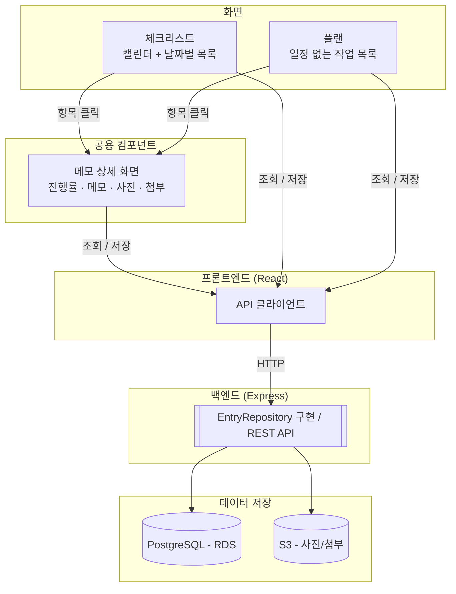
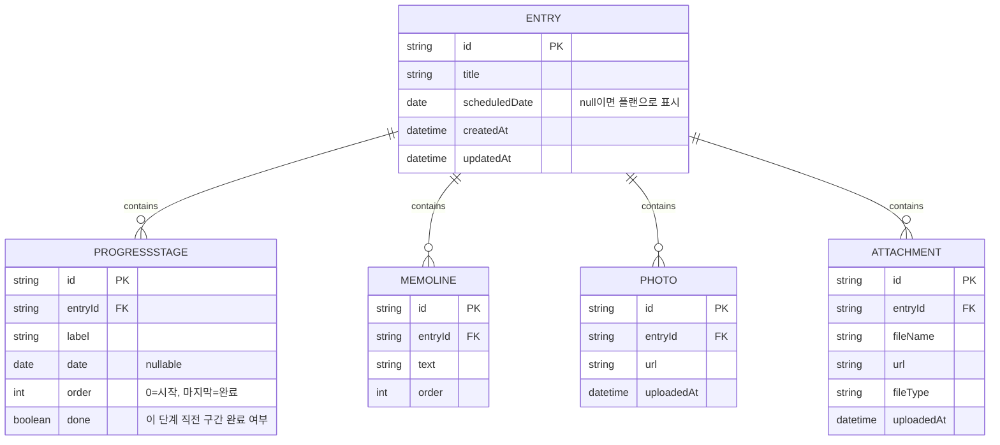

# 크리스체트 플랜 프로젝트

간단한 투두 프로젝트로 만드는 캘린더 기반 크리스체트 + 플랜 앱입니다. 바이브 코딩(AI와 함께 빠르게 구현)으로 시작을 이어갈 예정이며, 이 문서는 Claude Code(또는 다른 AI 코딩 어시스턴트)가 프로젝트 맥락을 파악하고 바로 구현을 시작할 수 있도록 정리한 스펙 문서입니다.

## 프로젝트 개요

사용자가 할 일을 두 가지 방식으로 관리하는 앱입니다. 날짜가 정해진 일은 캘린더에 붙여서 "체크리스트"로 관리하고, 날짜와 상관없이 자유롭게 쌓는 일은 "플랜"으로 관리합니다. 둘 다 모든 항목을 클릭하면 같은 형태의 상세 패널("메모 상세 패널")이 화면 안에 모달처럼 나타나며, 여기서 진행 단계, 메모(문장), 사진, 첨부파일을 관리합니다.

앱은 개인용으로 만들지만, 실제 사용 방식은 개인용입니다. 즉 할 일을 타인에게 배정하거나 공유하는 협업 기능은 없고, 데이터 구조와 화면은 1인 사용자 기준으로 설계되어 있습니다.

## 핵심 기능

1. 캘린더 — 월간 뷰, 날짜별로 항목이 표시됨
2. 날짜별 체크리스트 — 캘린더의 특정 날짜에 연결된 할 일 목록
3. 플랜 — 일정과 관계없이 쌓아 두는 자유 작업 목록 (날짜 없음)
4. 메모 — 체크리스트든 플랜이든, 항목 상세 화면에 줄 단위로 넣는 문장(노트)

## 부가 기능

1. 진행 단계 타임라인 — 항목별로 시작 단계와 완료 단계를 기본으로 가지며, 그 사이에 사용자가 원하는 만큼 중간 단계(예: 서류제출, spi, 1차면접, 2차면접)를 추가할 수 있음. 각 단계는 이름과 날짜를 가지고, 단계 사이 구간을 클릭하면 체크 표시로 완료 여부를 토글함. 진행률(%)은 이 구간 완료 개수로부터 계산되는 파생값.
2. 사진 — 항목에 이미지 첨부, 업로드 시 작은 썸네일로 미리보기
3. 첨부파일 — 항목에 파일 첨부, 업로드 후 목록에서 열어 확인하는 용도

## AI 비서 기능

체크리스트/플랜 화면 상단의 "AI 비서" 입력창에 자연어로 요청하면 Claude API(`claude-opus-5`)가 처리합니다 (`POST /api/ai/assistant`, 구현은 `backend/src/ai/runScheduleAssistant.ts`).

- **동작 방식**: 매 요청마다 현재 존재하는 모든 Entry(id·제목·날짜·단계·메모)를 컨텍스트로 함께 전달하고, `create_entry`/`update_entry`/`delete_entry`/`add_stage`/`update_stage`/`delete_stage`/`add_memo`/`update_memo`/`delete_memo` 아홉 개 도구(Tool Runner)를 제공합니다. 요청이 이미 존재하는 항목을 가리키면(제목/날짜로 매칭) 그 항목을 수정하고, 존재하지 않는 새로운 일을 설명하면 새 항목을 생성합니다 — 절대 중복 생성하지 않습니다.
- **여러 일정 한 번에**: "22일엔 A, 23일엔 B, 24일엔 C" 처럼 서로 다른 날짜/주제의 일정을 한 문장에 섞어도 각각 별도 Entry로 생성됩니다. 반대로 "OO 예약에 단계 추가하고 메모도 남겨줘"처럼 하나의 일에 딸린 하위 작업은 그 한 Entry에 반영됩니다.
- **동시성 주의**: AI가 한 요청에서 같은 항목에 여러 단계/메모를 동시에 추가할 수 있어, `PgEntryRepository.addStage`/`addMemoLine`은 트랜잭션 + `pg_advisory_xact_lock`으로 항목별 직렬화되어 있습니다. 새로 추가되는 항목별 쓰기 메서드도 이 패턴을 따라야 순서 꼬임을 피할 수 있습니다.
- 응답은 영향을 받은 Entry 배열이며, 프론트엔드는 이를 이용해 캘린더를 해당 날짜로 이동시키고 목록을 새로고침합니다. 현재 열려 있는 상세 패널도 `refreshSignal`을 통해 자동으로 다시 불러옵니다.

## 확정된 설계 결정

- **체크 vs 플랜**: 화면은 다르지만 데이터 구조는 동일한 `Entry` 필드로 통합. `scheduledDate`가 있으면 체크리스트에, 없으면(`null`) 플랜에 표시됨.
- **메모(MemoLine)**: 체크박스 없는 순수 텍스트. 완료 여부를 추적하지 않으므로 진행 단계 계산에 관여하지 않음.
- **진행 단계(ProgressStage)**: 모든 Entry는 생성 시 기본으로 "시작"/"완료" 두 단계를 가짐. 사용자가 그 사이에 원하는 만큼 중간 단계를 추가/삭제/수정 가능(단, 시작/완료 단계 자체는 삭제 불가). 각 단계는 `done` 플래그를 가지며, 이는 "그 단계 직전 구간이 완료되었는지"를 의미. 목록에 표시되는 진행률(%)은 `done`인 구간 수 / 전체 구간 수로 계산하는 파생값이며 별도로 저장하지 않음.
- **상세 패널 재사용**: 체크 항목과 플랜 항목이 같은 상세 패널 컴포넌트를 공유. 페이지 이동이 아니라 목록 옆에 인라인 패널(모달 형태)로 떴다 사라짐.

## 화면 구성

### ① 체크리스트 화면 (상단 캘린더 + 하단 좌측 목록 + 하단 우측 상세 패널)
- 상단: 월간 캘린더 전체 너비 표시. 각 날짜 칸에는 그 날 Entry 제목이 짧게 태그로 보임.
- 하단 좌측: 선택한 날짜의 Entry 목록 (세로 목록). 새 항목 추가 시 `scheduledDate`가 선택된 날짜로 채워진 Entry 생성.
- 하단 우측: 항목 클릭 시 해당 자리에 메모 상세 패널이 나타남. 우측 상단 × 버튼으로 패널만 닫힘 (목록/캘린더는 그대로 유지).

### ② 플랜 화면 (좌측 목록 + 우측 상세 패널)
- 좌측: 캘린더 없이 Entry 목록만 표시. `scheduledDate`가 `null`인 Entry만 표시. 새 항목 추가 시 `scheduledDate: null`인 Entry 생성.
- 우측: ①과 동일한 메모 상세 패널이 항목 클릭 시 나타남.

### ③ 메모 상세 패널 (체크/플랜 공통, 재사용, 인라인 모달)
- 제목 (수정 가능)
- 진행 단계 타임라인 (시작 ─ 중간 단계들 ─ 완료, 구간 클릭으로 완료 토글, 중간 단계 추가/삭제/이름·날짜 수정)
- 메모 목록 (문장 추가/수정/삭제)
- 사진 (업로드 시 썸네일 미리보기, 여러 장 가능)
- 첨부파일 (업로드 후 목록에서 열어 확인, 여러 개 가능)
- 우측 상단 × 버튼 → 패널만 닫힘, 목록 화면은 그대로 유지

## 데이터 모델

```ts
interface Entry {
  id: string
  title: string
  scheduledDate: string | null   // null이면 플랜, 값이 있으면 체크리스트에 표시 (ISO date string)
  stages: ProgressStage[]         // 진행 단계 타임라인. 첫 번째=시작, 마지막=완료, 그 사이는 사용자 정의
  memos: MemoLine[]
  photos: Photo[]
  attachments: Attachment[]
  createdAt: string
  updatedAt: string
}

interface ProgressStage {
  id: string
  label: string
  date: string | null   // ISO date string
  order: number          // 정렬 순서 (0 = 시작, 마지막 = 완료)
  done: boolean          // 이 단계 직전 구간이 완료되었는지
  isDefault: boolean     // 앱이 자동 생성한 시작/완료 단계이며 아직 사용자가 이름을 수정하지 않았는지
}

interface MemoLine {
  id: string
  text: string
  order: number
}

interface Photo {
  id: string
  url: string
  uploadedAt: string
}

interface Attachment {
  id: string
  fileName: string
  url: string
  fileType: string
  uploadedAt: string
}
```

## 기술 스택

- **프론트엔드**: React + Vite + TypeScript
- **백엔드**: Node.js + Express + TypeScript (REST API)
- **데이터베이스**: PostgreSQL (AWS RDS)
- **파일 저장소**: AWS S3 (사진/첨부파일)
- **배포 대상**: AWS

모노레포 구조로 `frontend/`, `backend/` 디렉터리를 분리하여 진행합니다.

## 데이터 접근 계층 (Repository 패턴)

화면 컴포넌트는 아래 인터페이스만 바라보고 구현합니다. 프론트엔드는 이 인터페이스를 호출하는 API 클라이언트로, 백엔드는 이 인터페이스에 대응하는 REST 엔드포인트 + PostgreSQL 저장으로 구현합니다.

```ts
interface EntryRepository {
  getAllEntries(): Entry[]
  getEntriesByDate(date: string): Entry[]   // 체크리스트 화면용
  getPlanEntries(): Entry[]                  // 플랜 화면용 (scheduledDate == null)
  getEntryById(id: string): Entry | undefined
  createEntry(params: { title: string; scheduledDate: string | null }): Entry
  updateEntry(id: string, patch: Partial<Entry>): void
  deleteEntry(id: string): void

  addMemoLine(entryId: string, text: string): void
  updateMemoLine(entryId: string, lineId: string, text: string): void
  deleteMemoLine(entryId: string, lineId: string): void

  addStage(entryId: string, params: { label: string; date: string | null }): void
  updateStage(entryId: string, stageId: string, patch: { label?: string; date?: string | null; done?: boolean }): void
  deleteStage(entryId: string, stageId: string): void   // 시작/완료 단계는 삭제 불가

  addPhoto(entryId: string, file: File): void
  removePhoto(entryId: string, photoId: string): void

  addAttachment(entryId: string, file: File): void
  removeAttachment(entryId: string, attachmentId: string): void
}
```

## 아키텍처 다이어그램 (Mermaid)





## 아직 정해지지 않은 것 (구현 중 결정 필요)

- **캘린더 날짜 칸 표시 방식**: 하루에 Entry가 여러 개일 때 태그를 몇 개까지 보여줄지 (전체 표시 vs "+2개" 요약).
- **인증**: 개인용 앱이므로 초기엔 인증 없이 진행할지, 최소한의 로그인(단일 사용자)을 둘지.
- **사진/첨부파일 영구 저장소**: 현재는 백엔드 서버 로컬 디스크(`backend/uploads/`)에 `multer`로 저장 중. AWS 배포 시 이대로 EC2 로컬 디스크를 쓸지(인스턴스 재생성/스케일아웃 시 유실 위험), S3로 옮길지 결정 필요.
- **AWS 배포 구성**: EC2 vs Elastic Beanstalk 등 백엔드 호스팅 방식, RDS 네트워크 구성(VPC, 보안그룹) 세부사항.

## 구현 시 참고사항 (AI 코딩 어시스턴트용)

- `Entry`는 체크와 플랜을 아우르는 단일 엔티티입니다. 두 화면을 별도 데이터 구조로 중복 구현하지 마세요.
- `MemoLine`에는 완료 상태(`done`)가 없습니다. 체크박스를 넣지 마세요 — 순수 텍스트 노트입니다.
- `stages`는 항상 최소 2개(시작, 완료)를 가집니다. 첫 번째와 마지막 단계는 이름/날짜는 수정 가능하지만 삭제할 수 없습니다. 목록에 보이는 진행률(%)은 `done`인 구간 수를 기반으로 계산하는 파생값이며 별도 필드로 저장하지 않습니다.
- **다국어(한국어/English/日本語)**: 우측 상단 토글로 전환하며 `react-i18next` 기반. UI 텍스트(버튼, 안내 문구, 캘린더 요일/월 표기 등)는 정적으로 번역됩니다. 앱이 자동 생성하는 시작/완료 단계 라벨은 `isDefault: true`인 동안만 언어에 따라 번역되어 보이며, 사용자가 그 이름을 한 번이라도 수정하면 `isDefault`가 `false`로 바뀌면서 이후로는 입력한 텍스트 그대로 고정됩니다.
- **사용자 콘텐츠 번역**: 항목 제목, 메모, 커스텀 진행 단계 이름처럼 사용자가 직접 입력한 텍스트도 `POST /api/translate`(Claude API 기반, `translations` 테이블에 (원문, 대상 언어) 쌍으로 캐싱)를 통해 화면에 표시될 때 언어에 맞게 번역됩니다. 프론트엔드 `ContentTranslationProvider`(`contexts/ContentTranslationContext.tsx`)가 화면에 보이는 텍스트를 모아 배치로 요청하고 결과를 캐싱합니다. **DB의 원본 텍스트는 절대 번역본으로 덮어써지지 않습니다** — 입력 필드는 번역된 텍스트를 보여주되, 그 값을 그대로 두고 포커스를 잃으면(실제 수정 없음) 저장하지 않고, 사용자가 실제로 새 텍스트를 입력한 경우에만 그 시점에 입력한 언어 그대로 저장합니다(이미 있던 시작/완료 단계 라벨의 `isDefault` 처리와 동일한 패턴). 이 컨텍스트를 사용하는 컴포넌트를 새로 만들 때는 `requestTexts()`로 필요한 문자열을 등록하고 `translate()`로 표시값을 가져오되, 입력 필드는 `key`에 번역 결과를 포함시켜 언어/번역이 바뀔 때 리마운트되도록 해야 uncontrolled input이 새 값을 반영합니다.
- **사진/첨부파일**: `multer`로 백엔드가 받아서 `backend/uploads/{photos,attachments}/`에 저장하고(`backend/src/storage.ts`), DB(`photos`/`attachments` 테이블)에는 `/uploads/...` 상대 경로만 저장합니다. `index.ts`에서 `express.static(UPLOADS_DIR)`로 서빙합니다. base64나 blob URL 임시 처리가 아니라 실제로 서버에 영구 저장되는 구조입니다.
